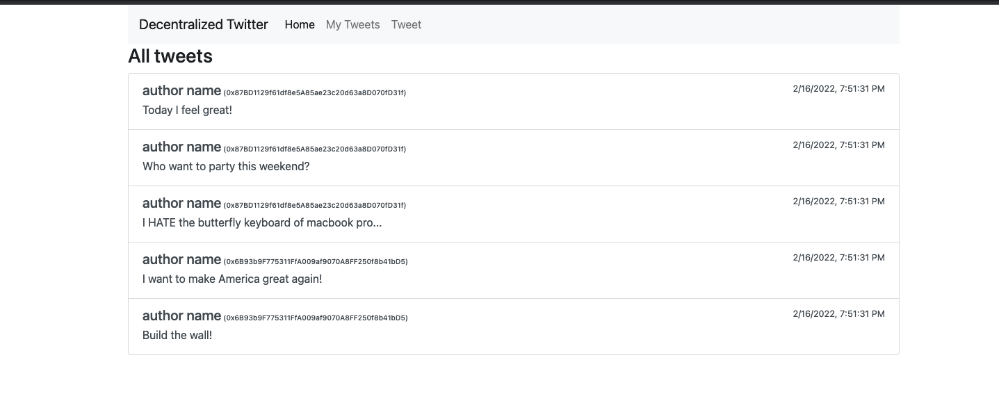

# twitter-dapp
Twitter on the Ethereum Blockchain Proof of Concept



# Truffle Configuration

## Install dependencies

Set up Truffle
```
npm install -g truffle
```

## Run locally in development

Install Ganache-CLI
```
npm install -g ganache-cli
```

Then run `ganache-cli --account_keys_path keys.json` and it runs the server and stores keys in local keys.json hash

### Configuring Truffle Framework to run locally

Copy `.env.sample` over to `.env` and enter both your ALICE_ADDRESS and DONALD_ADDRESS.

### Using it to deploy (or migrate) a contract instance

Run `truffle deploy --network development` in the /tests directory order to get contract deployed.

### Accessing the deployed instance and interact with it (via Truffle console)

Run `npm install` in order to hd wallet and other dependencies.

Run `truffle console --network development` to load up the console 

Run `Twitter.deployed().then(function(instance){return instance });` to verify your contract is deployed.

## Run remotely on Rinkeby test network

### Make sure you already have
1. Download your wallet from [Metamask](https://metamask.io/)
2. Create 2 Metamask accounts, one for ALICE_ADDRESS and another for DONALD_ADDRESS
3. Select a drop down to show/hide test networks
4. Get some Rinkeby [test ether](https://faucet.rinkeby.io/) (may take more than one provider or attempt)
5. [Signup for Infura](https://infura.io/register) to create a new project and Rinkeby API key

### Configuring Truffle Framework to the Rinkeby test network

Copy `.env.sample` over to `.env` and enter both your API_URL, MNEMONIC, ALICE_ADDRESS and DONALD_ADDRESS.

### Using it to deploy (or migrate) a contract instance

Run `npm install` in order to hd wallet and other dependencies.

Run `truffle deploy --network rinkeby` in the /tests directory order to get contract deployed.

### Accessing the deployed instance and interact with it (via Truffle console)

Run `truffle console --network rinkeby` to load up the console 
Run `Twitter.deployed().then(function(instance){return instance });` to verify your contract is deployed.

# Run Web3 application either locally or on Rinkeby

Go into /app directory and run `npm install` and then `yarn start`

**If running locally be sure to import private keys from ganache into Metamask

# Notes

- UI is breaking and still needs some work.
